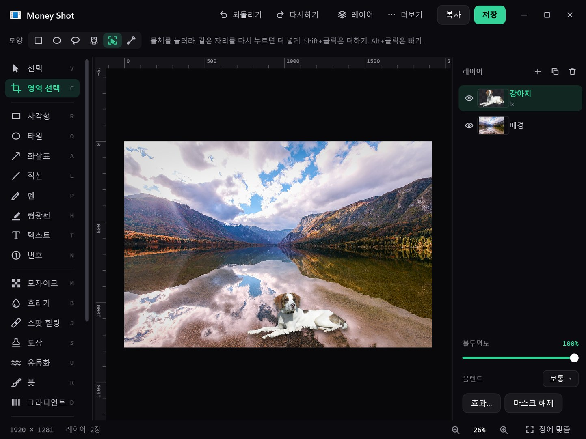
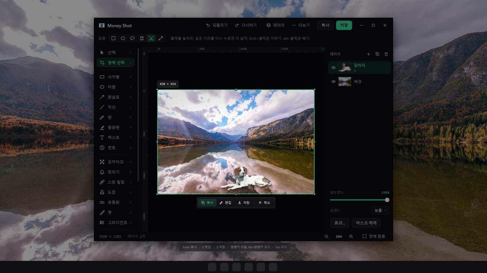

<p align="center"></p>

<h1 align="center">Money Shot</h1>
<p align="center"><b>결정적 한 컷을 건지는 캡처 도구.</b> 1MB도 안 되는 윈도우 캡처 앱에 꽤 쓸 만한 편집기를 넣었다.<br>
<a href="README.md">English</a></p>

---

**1MB 미만. 계정도, 수집도 없다.** 트레이에 상주하고, 컴퓨터를 켜면 창 없이 올라오며, 단축키는 켜자마자 먹는다.
캡처하면 클립보드 복사는 이미 끝나 있고 우하단에 썸네일이 튀어나온다("Money~~!!"). 무시하면 사라지고, 누르면 편집창이 열린다.

<p align="center"></p>

## 캡처

| 단축키 | 동작 |
|---|---|
| `PrintScreen` | 영역 |
| `Alt` + `PrintScreen` | 커서 밑의 창 |
| `Shift` + `PrintScreen` | 커서가 있는 모니터 전체 |
| `Ctrl` + `PrintScreen` | 스크롤 캡처 (긴 페이지) |
| `Ctrl` + `Shift` + `E` | 마지막 캡처를 편집창에서 열기 |

<p align="center"></p>

**영역.** 끌어서 고른다. 8배 확대경이 커서 밑 픽셀을 좌표·색상값과 함께 보여준다.
`Shift`를 누르면 정사각형, 끌지 않고 클릭하면 그 자리의 창, `Space`는 창 모드, `Ctrl+A`는 모니터 전체.
기본은 손을 떼는 순간 찍힌다. 설정에서 끄면 손잡이로 먼저 다듬을 수 있다(방향키 이동, `Alt`+방향키 크기, 그다음
`Enter` 복사 · `E` 편집 · `S` 저장). 오른쪽 클릭이나 `Esc`는 취소.

**스크롤.** `Ctrl+PrintScreen`을 누르면 스크롤되는 영역을 알아서 찾아 보여준다(맞으면 `Enter`, 아니면 모서리를 끌어 고친다).
그다음 알아서 굴리며 이어 붙이는데, 굴린 양을 믿지 않고 화면 내용을 맞춰 붙인다 — 배율이 125%처럼 소수여도,
부드러운 스크롤·관성 스크롤이어도 어긋나지 않는다. 위에 붙어 다니는 메뉴 띠는 한 번만 남긴다.
`Esc`를 누르면 거기까지 붙인 것을 준다. 마우스 휠로 스크롤되는 곳이면 된다.

**찍은 다음.** 클립보드 복사는 이미 끝나 있다. 구석에 썸네일이 뜬다("Money~~!!") —
누르면 편집, 끌어서 메신저·문서에 바로 놓기, 두면 사라진다.

다중 모니터와 모니터별 배율이 섞인 환경도 물리 픽셀 기준으로 다룬다. 윈도우 11에서 캡처 도구가 `PrintScreen`을 잡고 있으면
설정에서 되찾을 수 있고, 다른 앱이 이미 쓰는 단축키도 알려준다.

<p align="center"></p>

## 편집

- **레이어** — 비파괴 마스크, 불투명도, **블렌드 모드 24종**, **그룹**, **조정 레이어**
- **레이어 효과** — 그림자, 바깥·안쪽 광선, 안쪽 그림자, 색 덮기, 테두리 (레이어를 고치면 따라온다)
- **선택** — 사각형, 원형, 올가미, 자동 올가미, **색상 범위**, **물체 선택(AI)**: 누르면 그 물체만, 다시 누르면 더 넓게
- **고치기** — 스팟 힐링, 도장, 내용 채우기, 유동화(밀기·문지르기·흐리게)
- **보정** — 레벨, 커브, 색조/채도, 컬러 밸런스, 흑백, 그리고 라이트룸식 **RAW 보정**
  (노출, 화이트 밸런스, 텍스처, 부분 대비, 디헤이즈, 톤 커브, HSL, 색 보정, 선명하게, 노이즈 감소, 렌즈, 기하)
- **필터** — 가우시안·동작 흐림, 노이즈, 비네팅, 블룸, 톤 대비, 렌즈 왜곡, 노출, 그라디언트 맵, 그레인, **디더링** 11가지
- **배경 지우기(AI)**와 다듬기 창(가장자리·대비·경계 이동), 머리카락·복잡한 배경용 **정밀** 모드
- **마크업** — 사각형, 타원, 화살표, 직선, 펜, 형광펜, 텍스트, 번호 스탬프
- **변형** — 자유 변형, 기울이기, **원근**, 자르기, 크기, 회전, 눈금자·가이드(달라붙기)
- **PSD** — PSD/PSB를 레이어째 연다(8/16비트, RGB/흑백/CMYK). 레이어를 살려 PSD로 저장
- 한국어·영어 화면 (윈도우를 따르고, 설정에서 바꿀 수 있다)

| 배경 지우기 | 물체 선택 |
|---|---|
|  |  |

<p align="center"><br><sub>RAW 보정 — 전 / 후</sub></p>

## 설치

1. **[최신 릴리스](https://github.com/curisama/MoneyShot/releases/latest)**에서 **`MoneyShot-Setup-x.y.exe`**(1MB 미만)를 받는다.
2. 실행한다. *"Windows의 PC 보호"* 창이 뜨면 **추가 정보 → 실행**을 누른다.
   설치 파일에 아직 코드 서명이 없어서 SmartScreen이 게시자를 모르기 때문이다.
3. **설치**를 누른다. 관리자 권한이 필요 없다. 사용자 폴더(`%LOCALAPPDATA%\Programs\Money Shot`)에 깔리고 시작 메뉴에 바로가기가 생긴다.
4. 머니샷은 트레이(오른쪽 아래 시계 옆)에 올라온다. **`PrintScreen`**을 눌러 보면 된다.
   트레이 아이콘: 클릭 = 영역 캡처, 두 번 클릭 = 편집창, 오른쪽 클릭 = 메뉴(캡처 종류 전부, **설정…**, 종료).

**윈도우 11:** `PrintScreen`을 눌렀는데 캡처 도구가 뜨면 설정을 연다(트레이 아이콘 오른쪽 클릭 → **설정…**,
또는 시작 메뉴에서 머니샷을 한 번 더 실행). 그 상태를 알아채고 **PrintScreen 키 되찾기** 단추를 보여준다.

**업데이트:** 새 설치 파일을 그냥 실행하면 된다. 설정과 받아 둔 AI 모델은 그대로 남는다.
**제거:** *설정 → 앱 → 설치된 앱 → Money Shot → 제거*.
받아 둔 AI 모델은 `%APPDATA%\Money Shot\models`에 있다 — 깨끗이 지우려면 이 폴더도 지운다.

## AI 기능은 선택

모든 기능이 오프라인으로 돈다. AI 기능(배경 지우기, 정밀 배경 지우기, 물체·피사체 선택)은
**처음 쓸 때, 묻고 나서** 원래 배포처에서 모델을 받는다.

| 기능 | 모델 | 크기 | 라이선스 |
|---|---|---|---|
| 배경 지우기 | silueta (rembg / U-2-Net) | 44MB | rembg MIT, 가중치는 원 배포처 기준 |
| 정밀 배경 지우기 | BiRefNet lite | 224MB | MIT |
| 물체 선택 | MobileSAM | 45MB | MIT / Apache-2.0 |
| 추론 엔진 | ONNX Runtime 1.16.3 | 10MB | MIT |

받은 파일은 정해 둔 SHA-256과 맞을 때만 쓴다. Money Shot은 아무것도 수집하거나 보내지 않는다.

## 직접 빌드

Visual Studio도, SDK도, NuGet도 필요 없다. 윈도우에 들어 있는 C# 컴파일러(.NET Framework 4.x)만 쓴다.

```powershell
powershell -ExecutionPolicy Bypass -File build.ps1          # → Money Shot.exe (약 1초)
powershell -ExecutionPolicy Bypass -File make-installer.ps1  # → 설치 파일 한 개
```

## 출처와 라이선스

Money Shot은 MIT 라이선스다. 편집 기능 일부는 Robbie Tilton의 [Compositor](https://github.com/robbietilton/Compositor)(MIT)에서 옮겼다 —
[THIRD_PARTY_NOTICES.md](THIRD_PARTY_NOTICES.md) 참고.
Adobe·Photoshop·Camera Raw는 Adobe의 상표이며, Money Shot은 Adobe와 관계가 없다.
스크린샷의 예시 사진은 Wikimedia Commons(CC0) 것이다.
