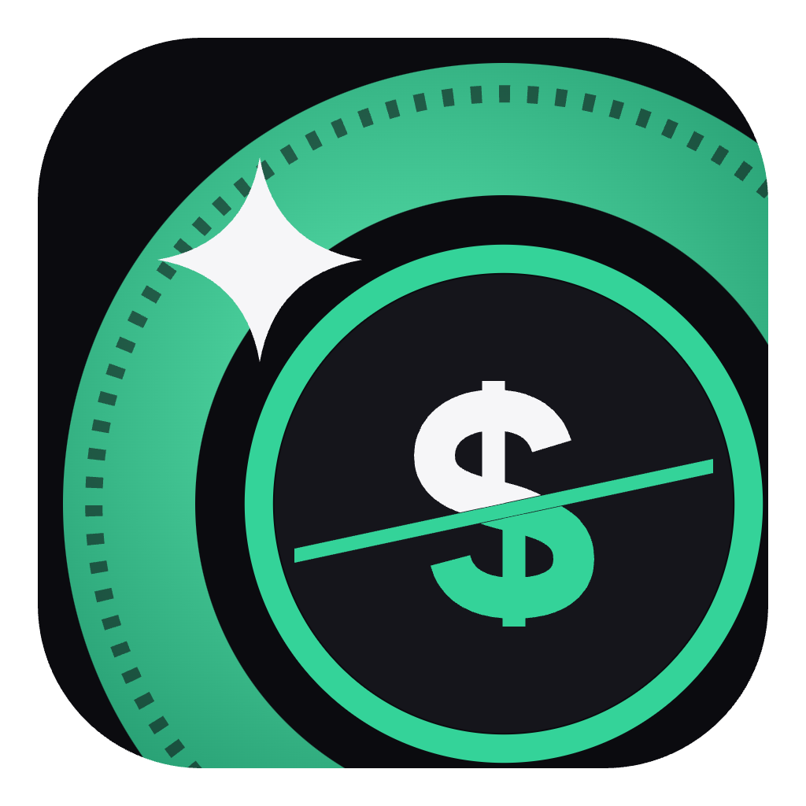
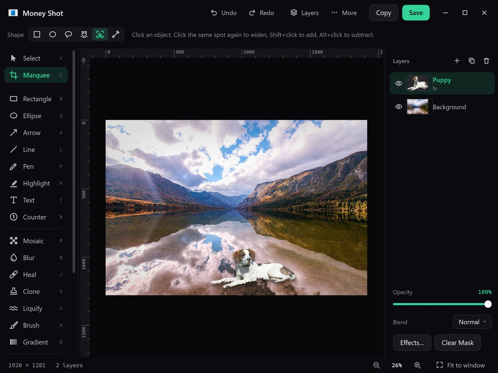
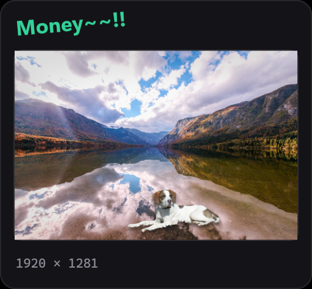
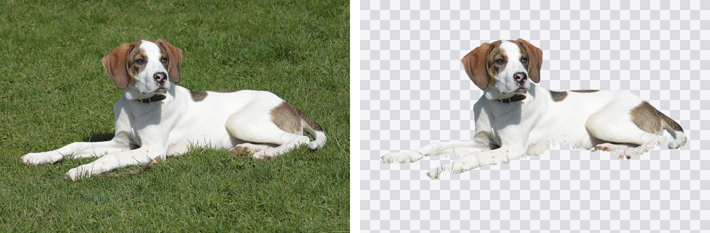
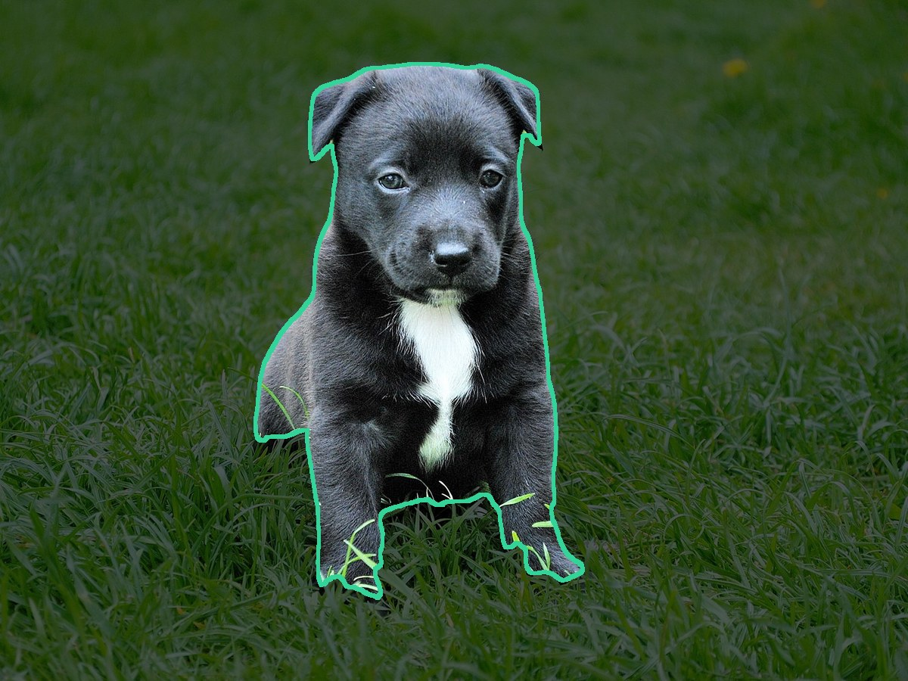
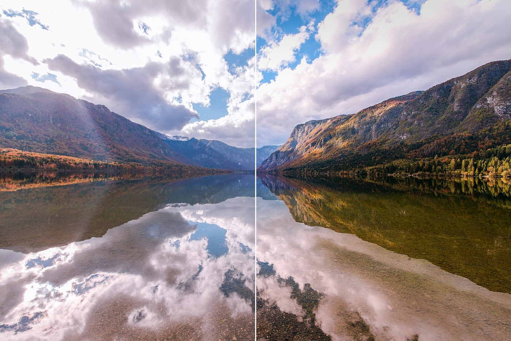

<p align="center"></p>

<h1 align="center">Money Shot</h1>
<p align="center"><b>Grab the shot that matters.</b> A tiny Windows screen-capture tool with a surprisingly capable image editor.<br>
<a href="README.ko.md">한국어</a></p>

---

**Under 1 MB. No install wizard maze, no account, no telemetry.** It lives in the tray, starts with Windows without a window,
and its hotkeys work from the first second. Capture → it's already on your clipboard → a thumbnail slides in ("Money~~!!").
Ignore it and it goes away; click it to open the editor.

<p align="center"></p>

## Capture

| Shortcut | Action |
|---|---|
| `PrintScreen` | Region (Space = window, Ctrl+A = whole monitor, 8× loupe with color readout) |
| `Ctrl` + `PrintScreen` | Scrolling capture — stitches pages by matching content, not by trusting scroll amounts |
| `Alt` + `PrintScreen` | Window under the cursor |
| `Shift` + `PrintScreen` | Whole monitor under the cursor |
| `Ctrl` + `Shift` + `E` | Open the last capture in the editor |

Multi-monitor and mixed-DPI setups are handled in physical pixels.

<p align="center"></p>

## Editor

- **Layers** with non-destructive masks, opacity, **24 blend modes**, **groups** and **adjustment layers**
- **Layer effects** — drop shadow, outer/inner glow, inner shadow, color overlay, stroke (live; they follow your edits)
- **Selections** — rectangle, ellipse, lasso, magnetic lasso, **color range**, and **Object Select (AI)**: click a thing, click again to widen
- **Retouch** — Spot Healing, Clone Stamp, Content-Aware Fill, Liquify (push / smudge / blur)
- **Adjustments** — Levels, Curves, Hue/Saturation, Color Balance, Black & White, and a full **RAW Develop** panel
  (exposure, white balance, texture, clarity, dehaze, tone curve, HSL, color grading, sharpening, noise reduction, lens, geometry)
- **Filters** — Gaussian / motion blur, noise, vignette, bloom, tonal contrast, lens distortion, exposure, gradient map, grain, and 11 **dither** looks
- **Background removal (AI)** with a refine panel (edges, contrast, shift edge), plus a **precise** mode for hair and busy backgrounds
- **Markup** — boxes, ellipses, arrows, lines, pen, highlighter, text, numbered stamps
- **Transform** — free transform, skew, **perspective**, crop, resize, rotate, rulers & guides with snapping
- **PSD** — opens PSD/PSB with layers (8/16-bit, RGB/Gray/CMYK); saves layered PSD
- English and Korean UI (follows Windows; switch in Settings)

| Background removal | Object Select |
|---|---|
|  |  |

<p align="center"><br><sub>RAW Develop — before / after</sub></p>

## Install

Download **`MoneyShot-Setup-x.y.exe`** from [Releases](../../releases) and run it.
No administrator rights needed; it installs into your user profile and can be removed from *Settings → Apps*.

Windows SmartScreen may warn about an unknown publisher because the installer is not code-signed.

## AI features are optional

Everything works offline. The AI features (background removal, precise background removal, object/subject selection)
download their models **only when you first use them, and only after asking**, from the original publishers:

| Feature | Model | Size | License |
|---|---|---|---|
| Background removal | silueta (rembg / U-2-Net) | 44 MB | rembg MIT; weights per original source |
| Precise background removal | BiRefNet lite | 224 MB | MIT |
| Object Select | MobileSAM | 45 MB | MIT / Apache-2.0 |
| Inference engine | ONNX Runtime 1.16.3 | 10 MB | MIT |

Every downloaded file is verified against a fixed SHA-256 before use. Money Shot collects and sends nothing.

## Build from source

No Visual Studio, no SDK, no NuGet — just the C# compiler that ships with Windows (.NET Framework 4.x):

```powershell
powershell -ExecutionPolicy Bypass -File build.ps1          # → Money Shot.exe (about 1 second)
powershell -ExecutionPolicy Bypass -File make-installer.ps1  # → single-file installer
```

## Credits & license

Money Shot is MIT-licensed. Parts of the editor were ported from
[Compositor](https://github.com/robbietilton/Compositor) (MIT) by Robbie Tilton — see [THIRD_PARTY_NOTICES.md](THIRD_PARTY_NOTICES.md).
Adobe, Photoshop and Camera Raw are trademarks of Adobe; Money Shot is not affiliated with Adobe.
Sample photos in the screenshots are from Wikimedia Commons (CC0).
